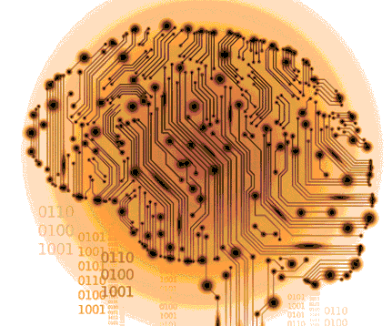

# eegChallenge
Prediction of sleep state using EEG data and model prediction



## Documentation
[Here](doc/EEG_Rapport.pdf) you can find explanations about how features are built and
models used to predict sleep states.

## Requirements
- Python 2.7 + [pip](https://pip.pypa.io/en/stable/installing/) 

- Python packages : numpy, scipy, scikit-learn, pandas, pywavelet  
- Numpy : [http://www.numpy.org/](http://www.numpy.org/)
- Scipy : [http://www.scipy.org/](http://www.scipy.org/)
- Scikit-learn : [http://scikit-learn.org/stable/](http://scikit-learn.org/stable/)
- Pandas : [http://pandas.pydata.org/](http://pandas.pydata.org/)
- pyWavelet : [http://pywavelets.readthedocs.org/en/latest/](http://pywavelets.readthedocs.org/en/latest/)

You can install them by typing:
```
pip install -r requirements.txt
```

## Run the code
Step 1 : Open the file main.py  
Step 2 : Check that mat_file point to the challenge data file. Data can be found into the `data` folder, just unzip it (about 500Mb).  
Step 3 : Save and run the file :
```
python main
```  
The process is quite slow, so be patient. If everything is okay, the result file
show up as ```pred_res.txt``` next to the main.
